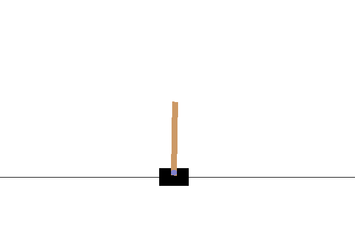
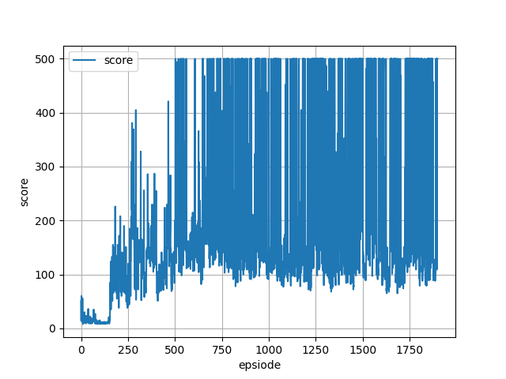

# Vanilla Actor Critic

This implements a vanilla actor critic architecture.

## Architecture

This is a simple actor critic architecture. Actor and critic networks share shallow two dense layers (1024, 512).

## Demo

## Score graph of `CartPole-v1`

## Environment

* Python 3.8
* Tensorflow 2.4
* Tensorflow Probability 0.12